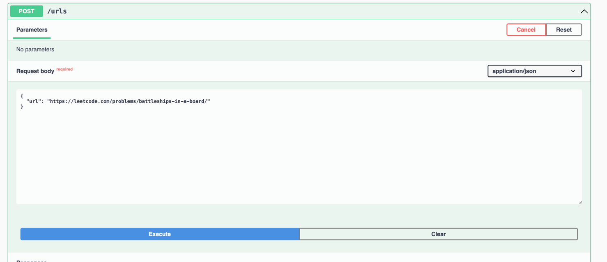
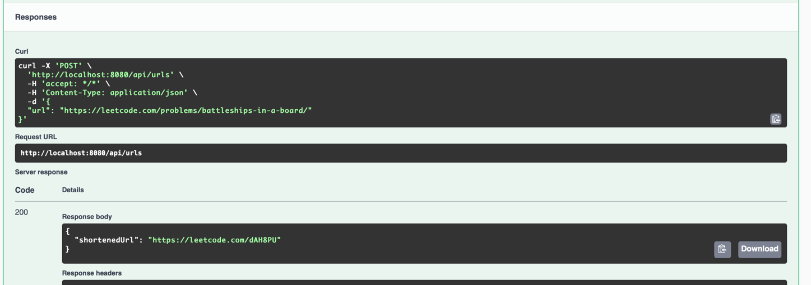
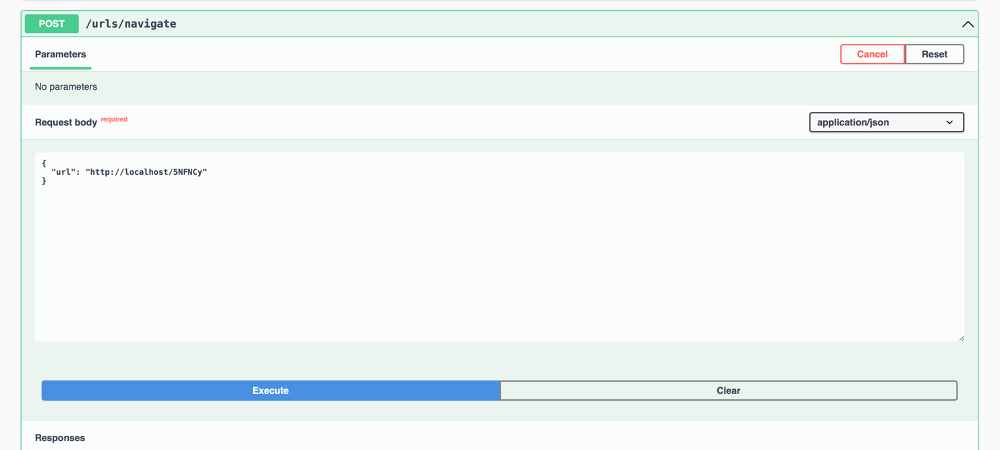
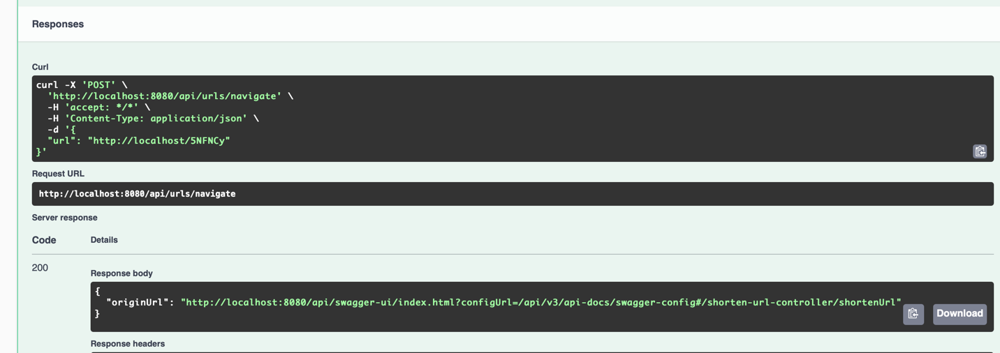
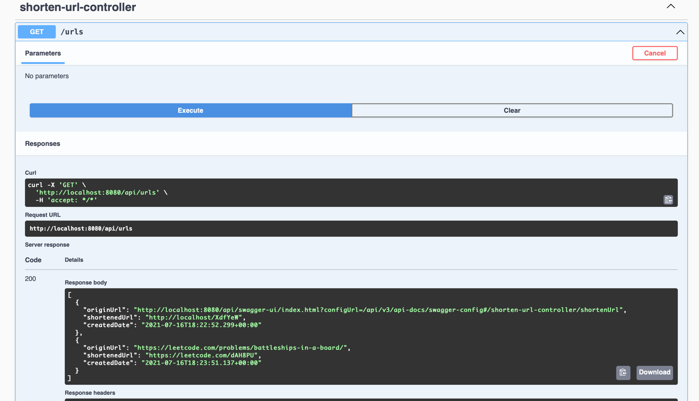

# TinyUrl Api
## Description
A shortened url rest api service bases on spring boot rest, spring data jpa, h2 db and onion architecture
## How to run this project
1. > Clone this project to your local machine
2. > Run `./mvnw clean install` at the root project to install the necessary dependencies
3. > Ru `cd infrastructure` and then `../mvnw spring-boot:run` 
4. > Navigate to [localhost:8080/api/swagger-ui.html](localhost:8080/api/swagger-ui/index.html)  to see swagger ui for testing
5. > Navigate to [http://localhost:8080/api/h2-console/](http://localhost:8080/api/h2-console/)  to see  h2 db web console
   >> jdbc url: jdbc:h2:mem:tiny_url_db
   > 
   >> User name: sa
   > 
   >> Password: Let it blank and press `Connect`
## TO DO
- Adding validation and error handling
- Adding Caching
- Supporting Pagination
## Use cases
### Submitting a long url
Request:

Response

### Navigating to shortened url
Request:

Response:

### Getting all url

